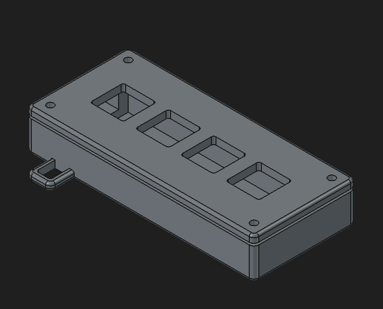
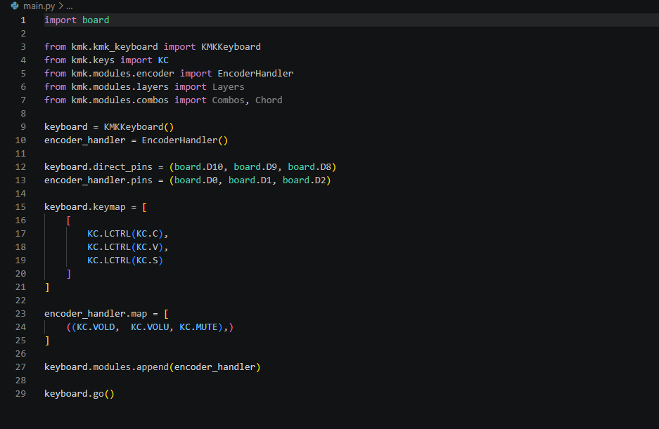
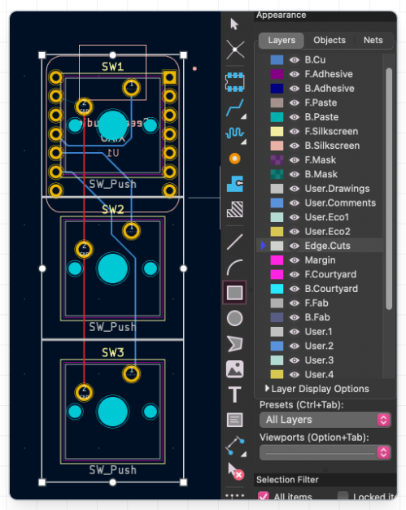
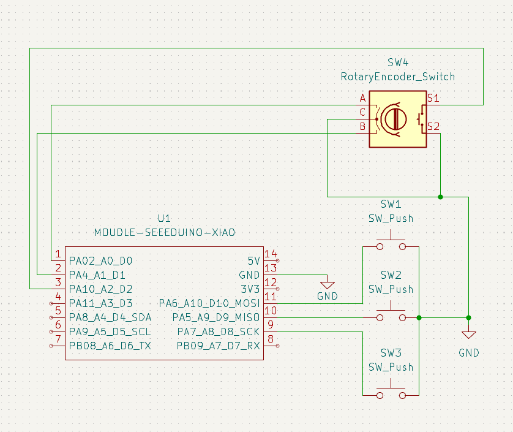

# Trident
The main idea is to make a hackpad that has 3 modes that you can change by rotating the knob

## Macros:

B1: ctrl+c
B2: ctrl+v
B3: ctrl+s

## PCB and Schematic

## Knob:
Turn left: Turn down the volume
Turn right: Turn up the volume
Click: Mutes the audio

## Built with:
**FreeCAD**
**KiCAD**
**Python(with KMK)**
